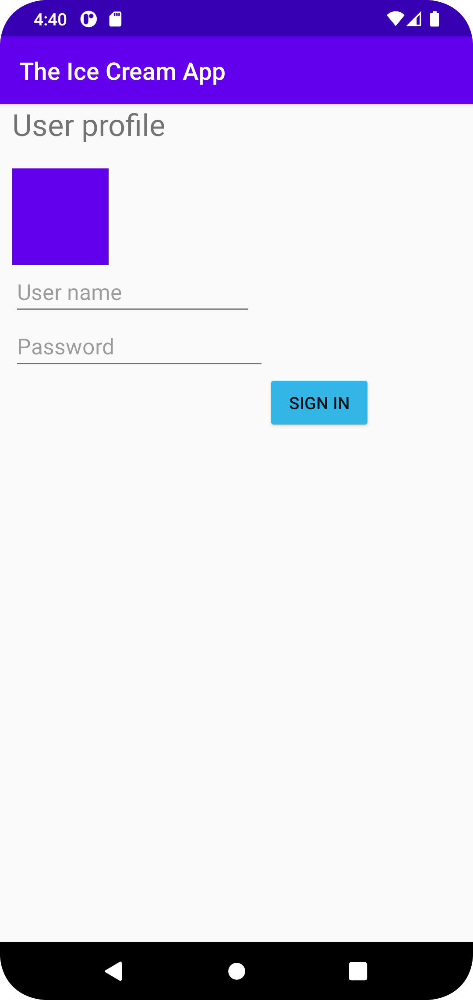

# Rapport

**Skriv din rapport här!**

Jag har ändrat layouten i appen. Detta genom att lägga till en ConstraintLayout. 
I denna så har jag även lagt till en Button, EditText och en ImageView. 
Detta är gjort i filen activity_main. 
Därefter så har jag stylat dessa genom att lägga till färg på ImageView och på knappen som jag lagt till. 
Jag har även gett alla widgets id:n och lagt in höjd, bredd och margin för att positionera ut dem.
Sedan ändrade jag även appens namn i filen strings.xml under app_name. 


Programkod för ImageView
```
 <ImageView
        android:id="@+id/signin_image"
        android:layout_width="80dp"
        android:layout_height="80dp"
        app:layout_constraintTop_toBottomOf="@+id/user_profile"
        app:layout_constraintStart_toStartOf="parent"
        android:layout_marginHorizontal="10dp"
        android:layout_marginTop="20dp"
        android:src="@color/colorPrimary" />
```
Programkod för Button 
```
   <Button
        android:id="@+id/signin_button"
        android:layout_width="wrap_content"
        android:layout_height="wrap_content"
        app:layout_constraintTop_toBottomOf="@+id/password"
        app:layout_constraintStart_toEndOf="@+id/password"
        android:backgroundTint="@android:color/holo_blue_light"
        android:text="Sign in" />
```



Läs gärna:

- Boulos, M.N.K., Warren, J., Gong, J. & Yue, P. (2010) Web GIS in practice VIII: HTML5 and the canvas element for interactive online mapping. International journal of health geographics 9, 14. Shin, Y. &
- Wunsche, B.C. (2013) A smartphone-based golf simulation exercise game for supporting arthritis patients. 2013 28th International Conference of Image and Vision Computing New Zealand (IVCNZ), IEEE, pp. 459–464.
- Wohlin, C., Runeson, P., Höst, M., Ohlsson, M.C., Regnell, B., Wesslén, A. (2012) Experimentation in Software Engineering, Berlin, Heidelberg: Springer Berlin Heidelberg.
